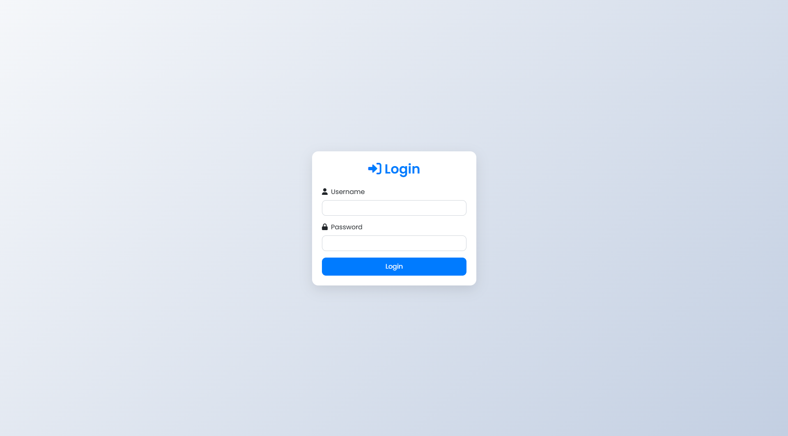

---

# 🛒 Ecommerce Website Project

This is a simple **Ecommerce Web Application** developed using **PHP** and **MySQL** as part of a Web Development class assignment. It includes both **user** and **admin** functionalities such as product listings, detailed views, shopping cart management, and product/category administration.

---

## ✨ Features

### 👤 User Side

* User Login / Logout
* Browse products by category
* View product details
* Add products to cart
* View cart and its contents

### 🛠️ Admin Side

* Admin Login / Logout
* Add new products
* Edit or delete existing products
* Add or delete product categories

---

## 🧰 Prerequisites

* PHP 7.4 or higher
* MySQL
* A Web Server (e.g., Apache via [XAMPP](https://www.apachefriends.org/) or [WAMP](http://www.wampserver.com/))
* Git (for cloning the repository)

---

## ⚙️ Setup Instructions

### 1️⃣ Clone the Repository

```bash
git clone <repository-url>
cd ecommerce
```

### 2️⃣ Set Up the Database

* Create a MySQL database named `ecommerce`.
* Import the provided SQL file:

```bash
mysql -u your_username -p ecommerce < database.sql
```

This will create the necessary tables and insert sample data.

### 3️⃣ Configure Database Connection

* Rename `config.sample.php` to `config.php`.
* Open `config.php` and update the database credentials:

```php
$servername = "localhost";
$username = "your_mysql_username";
$password = "your_mysql_password";
$database = "ecommerce";
```

### 4️⃣ Set Up Web Server

* Place the `ecommerce/` folder inside your web server's root directory:

  * For XAMPP: `htdocs/`
  * For WAMP: `www/`
* Ensure the `uploads/` folder is **writable**:

  ```bash
  chmod 777 uploads
  ```

---

## 🌐 Access the Website

1. Start your web server and MySQL.
2. Visit in your browser:

   ```
   http://localhost/ecommerce/
   ```

### 🔐 Demo Credentials

**User Login**

* Username: `user`
* Password: `user123`

**Admin Login**

* Username: `admin`
* Password: `admin123`

---

## 🗂️ Project Structure

```
ecommerce/
│
├── config.php               # Database connection (excluded from Git)
├── config.sample.php        # Sample config file
├── login.php                # Login form for users/admins
├── index.php                # Homepage (redirects to login/products)
├── products.php             # Product listing
├── product_details.php      # Individual product view
├── cart.php                 # Handles adding to cart
├── view_cart.php            # Displays cart contents
├── logout.php               # Logout functionality
│
├── /admin                   # Admin panel
│   ├── index.php            # Dashboard
│   ├── add_product.php      # Add new product
│   ├── manage_products.php  # Edit/Delete products
│   └── add_category.php     # Manage categories
│
├── /uploads                 # Product images (excluded from Git)
└── database.sql             # SQL dump for schema and sample data
```

---

## 📷 Screenshots

> You can add screenshots here by uploading images to the GitHub repository and referencing them using markdown like:

```markdown

```

---

## 👤 Author

**Mayan Roy**

---

## 🗓️ Submission Date

**June 09, 2025**

---


